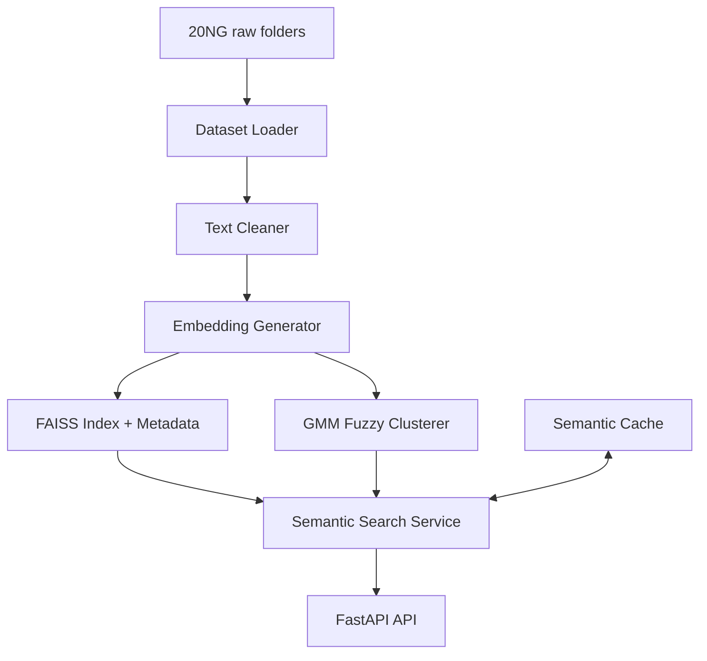

# 20 Newsgroups Semantic Search (Production-Style)

A production-oriented semantic retrieval system over 20 Newsgroups with:
- sentence-transformer embeddings (`all-MiniLM-L6-v2`)
- FAISS vector retrieval
- fuzzy clustering via GMM (soft memberships)
- custom semantic cache from first principles (no Redis/Memcached)
- FastAPI service with live cache state management


---

## 1) Architecture

### High-level flow

```text
Dataset
  ↓
Preprocessing
  ↓
Embeddings
  ↓
Vector DB + Fuzzy Clustering
  ↓
Semantic Cache
  ↓
FastAPI
```

### System diagram



---

## 2) Project Layout

```text
project/
├── data/dataset_loader.py
├── preprocessing/text_cleaner.py
├── embeddings/embedding_generator.py
├── vector_store/faiss_index.py
├── clustering/fuzzy_cluster.py
├── cache/semantic_cache.py
├── search/semantic_search.py
├── api/routes.py
├── bootstrap.py
├── main.py
├── requirements.txt
└── Dockerfile
```

This modular architecture makes the project **easy to maintain, extend, and scale**.

---

# Dataset

This system uses the **20 Newsgroups dataset**, a popular dataset for NLP research.

Dataset characteristics:

- ~20,000 Usenet posts
- 20 topic categories
- ~1000 documents per category

Example categories include:

- alt.atheism
- comp.graphics
- comp.sys.mac.hardware
- rec.autos
- rec.sport.baseball
- sci.space
- sci.med
- talk.politics.guns
- talk.religion.misc

Dataset directory layout:

```
DATASET_ROOT/
 ├── alt.atheism/
 ├── comp.graphics/
 ├── comp.os.ms-windows.misc/
 ├── comp.sys.ibm.pc.hardware/
 ├── comp.sys.mac.hardware/
 ├── comp.windows.x/
 ├── misc.forsale/
 ├── rec.autos/
 ├── rec.motorcycles/
 ├── rec.sport.baseball/
 ├── rec.sport.hockey/
 ├── sci.crypt/
 ├── sci.electronics/
 ├── sci.med/
 ├── sci.space/
 ├── soc.religion.christian/
 ├── talk.politics.guns/
 ├── talk.politics.mideast/
 ├── talk.politics.misc/
 └── talk.religion.misc/
```

---

# Preprocessing Pipeline

Usenet messages contain significant noise including headers and signatures.

The preprocessing pipeline performs:

- removal of email headers (`From`, `Subject`, `Organization`)
- removal of quoted replies starting with `>`
- removal of email signatures
- text normalization
- punctuation cleanup
- whitespace normalization
- removal of very short documents

These steps improve embedding quality.

---

# Embedding Generation

Document embeddings are generated using:

`sentence-transformers/all-MiniLM-L6-v2`

Advantages:

- lightweight
- fast inference
- strong semantic understanding
- widely used for semantic search

Each document is converted into a **dense vector representation**.

---

# Vector Database (FAISS)

The system uses **FAISS (Facebook AI Similarity Search)** for fast vector retrieval.

Configuration:

- normalized embeddings
- cosine similarity search
- index type: `IndexFlatIP`

Stored metadata:

- document_id
- cleaned text
- original category

This enables **fast semantic nearest-neighbor search**.

---

# Fuzzy Clustering

Instead of assigning each document to only one cluster, the system uses **Gaussian Mixture Models (GMM)** for soft clustering.

Example membership:

```
Document 1821

Cluster 2 : 0.61
Cluster 5 : 0.28
Cluster 7 : 0.11
```

Cluster selection uses:

- BIC score
- AIC score
- silhouette analysis

Benefits:

- captures overlapping topics
- improves semantic understanding
- optimizes cache lookup

---

# Semantic Cache (Built From Scratch)

The semantic cache prevents recomputation when similar queries are asked.

Unlike traditional caches, this system detects **semantic similarity** between queries.

Example:

Query 1: "best graphics card"  
Query 2: "recommended gpu"

Both map to similar embeddings.

Cache entry structure:

```
query_text
query_embedding
result
dominant_cluster
timestamp
```

Cache lookup process:

1. embed incoming query
2. predict dominant cluster
3. compare with cached queries in that cluster
4. compute cosine similarity
5. return cached result if similarity ≥ threshold

Default threshold:

`0.85`

Tracked metrics:

- total_entries
- hit_count
- miss_count
- hit_rate

---

# Offline Artifact Pipeline

Heavy ML steps run offline.

Run the pipeline:

```
python bootstrap.py   --dataset-root /path/to/20_newsgroups   --artifacts-dir ./artifacts
```

Generated artifacts include:

```
artifacts/
 ├ manifest.json
 ├ clean_corpus.parquet
 ├ embeddings.npy
 ├ index/
 │   ├ semantic.index
 │   └ metadata.json
 ├ gmm.joblib
 ├ membership.npy
 ├ cluster_analysis.parquet
 └ cluster_projection.parquet
```

These artifacts allow the API to start quickly without recomputing ML steps.

---

# Online Query Workflow

When a user sends a query:

1. Convert query to embedding
2. Check semantic cache
3. If cache hit → return cached result
4. If cache miss → perform FAISS vector search
5. Identify dominant cluster
6. Return top documents

Workflow:

```
User Query
   ↓
Query Embedding
   ↓
Semantic Cache Check
   ↓
Vector Search (FAISS)
   ↓
Cluster Analysis
   ↓
Return Results
```

---

# Example Query

Request:

```
POST /query

{
 "query": "graphics acceleration in windows",
 "top_k": 5
}
```

Example response:

```
{
 "query": "graphics acceleration in windows",
 "cache_hit": false,
 "similarity_score": 0.91,
 "dominant_cluster": 4,
 "documents": [
   "comp.graphics discussion on GPU rendering",
   "hardware discussion about graphics cards"
 ]
}
```

---

# API Endpoints

POST `/query` – search for relevant documents

GET `/cache/stats` – view cache metrics

DELETE `/cache` – clear semantic cache

GET `/health` – service health check

---

# Docker Deployment

Build container:

```
docker build -t semantic-20ng .
```

Run container:

```
docker run -p 8000:8000 -e ARTIFACTS_DIR=/app/artifacts semantic-20ng
```

---

# Technology Stack

- Python
- Sentence Transformers
- FAISS
- Scikit-learn
- FastAPI
- NumPy
- Pandas
- Docker

---

# Project Goal

This project demonstrates how to design a **modern semantic search system** combining:

- NLP embeddings
- vector similarity search
- fuzzy clustering
- intelligent caching
- scalable API services

The architecture reflects real-world systems used in:

- search engines
- recommendation systems
- AI assistants
